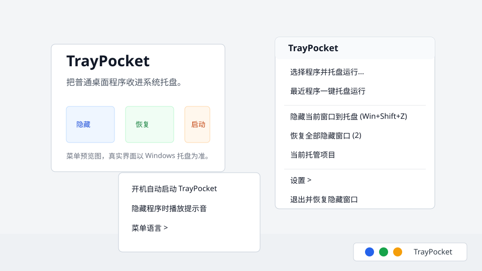

# TrayPocket

TrayPocket 是一个 Windows 系统托盘工具，用来把需要长期后台运行的普通桌面程序“一键收进右下角小图标”。

它的交互灵感来自 [fcFn/traymond](https://github.com/fcFn/traymond)：把窗口隐藏到托盘，双击托盘图标恢复窗口。TrayPocket 现在提供 Python 版实现，并保留早期 C# WinForms 实现作为参考。



## 功能

- 选择任意 `.exe`，启动后自动隐藏到系统托盘。
- 按 `Win + Shift + Z`，把当前前台窗口隐藏到托盘。
- 双击被托管程序的小图标，恢复对应窗口。
- 右键 TrayPocket 主图标，可以从“最近程序”再次一键托盘运行。
- 支持开机自动启动 TrayPocket。
- 支持设置隐藏窗口时是否播放系统提示音。
- 支持在设置中选择中文（简体）菜单。
- 对没有主窗口的程序，会按后台进程托管，并提供结束进程/移除图标菜单。

## 下载和安装

推荐从 GitHub Releases 下载 Python 版压缩包 `TrayPocket-python-v0.3.0-windows.zip`，解压后运行：

```powershell
PowerShell -ExecutionPolicy Bypass -File .\run-python.ps1
```

这版需要本机安装 Python 3.10+。

如果你只想使用早期免安装 exe，也可以下载 `TrayPocket.exe`，放到任意你喜欢的文件夹后双击运行。

如果你想运行 Python 版，请先安装 Python 3.10+，然后在项目目录运行：

```powershell
PowerShell -ExecutionPolicy Bypass -File .\run-python.ps1
```

也可以直接运行：

```powershell
python .\src\traypocket.py
```

Python 版只使用 Python 标准库，不依赖第三方包。

生成 Python 版发布压缩包：

```powershell
PowerShell -ExecutionPolicy Bypass -File .\build-python-package.ps1
```

如果你想从早期 C# 源码构建 exe，在项目目录运行：

```powershell
PowerShell -ExecutionPolicy Bypass -File .\build.ps1
```

生成文件：

```text
TrayPocket.exe
```

TrayPocket 不需要安装程序。第一次运行时，如果 Windows 出现安全提示，请确认文件来源是本项目 Release 或你本机自行构建的版本。

## 使用

1. 双击启动 `TrayPocket.exe`。
2. 在系统托盘右键点击 TrayPocket 图标。
3. 选择 `选择程序并托盘运行...`。
4. 选择你希望保持后台运行的 `.exe`。
5. 以后可从 `最近程序一键托盘运行` 快速启动。

也可以用命令行直接发送程序：

```powershell
.\TrayPocket.exe "C:\Path\To\App.exe"
```

如果 TrayPocket 已经在运行，这条命令会把程序路径发送给现有实例处理。

## 相较于 Traymond 的改进

- **从“隐藏当前窗口”扩展为“选择程序并托盘运行”**：不用先手动打开程序，再按热键隐藏。
- **最近程序列表**：常用后台程序可以从托盘菜单一键再次启动。
- **单实例转发**：重复运行 `TrayPocket.exe "程序路径"` 时，会把任务交给已运行的 TrayPocket 实例，避免多个主图标。
- **后台进程托管**：程序没有窗口时不会失败，而是显示为可管理的后台项目。
- **开机启动开关**：直接在托盘菜单里启用或关闭。
- **隐藏提示音开关**：可以选择隐藏窗口时保持安静，或播放一次系统提示音。
- **中文菜单设置**：在设置菜单里明确选择中文（简体）菜单。
- **中文界面和中文注释**：更适合中文用户继续修改和二次开发。
- **无需 .NET SDK 构建**：使用 Windows 自带的 .NET Framework C# 编译器即可生成 exe。

## 构建和源码

当前主线实现是 `src/traypocket.py`，这是一个纯标准库 Python 程序，直接调用 Windows API 实现托盘图标、菜单、热键和窗口隐藏。

仓库仍保留 `src/TrayPocket.cs`，它是早期 C# WinForms 实现，使用 Windows 自带的 .NET Framework C# 编译器构建，不要求安装 .NET SDK。

C# 版构建命令：

```powershell
PowerShell -ExecutionPolicy Bypass -File .\build.ps1
```

生成文件：

```text
TrayPocket.exe
```

如果 `TrayPocket.exe` 正在运行，构建脚本会提示你先从托盘菜单退出 TrayPocket，再重新构建。

## 注意事项

- 微软商店/UWP 应用、管理员权限窗口、特殊系统窗口可能无法被普通权限进程隐藏。
- TrayPocket 退出时会恢复被隐藏的窗口；没有窗口的后台进程会保持运行，除非你在菜单里手动结束。
- 当前版本优先覆盖个人桌面使用场景，还没有做安装包、自动更新和签名。

## 常见问题

### 为什么有些窗口不能隐藏？

管理员权限窗口、微软商店/UWP 应用、系统桌面、任务栏和部分特殊窗口可能不允许被普通权限进程隐藏。这是 Windows 权限和窗口模型限制。

### 配置保存在哪里？

最近程序列表保存在当前用户目录：

```text
%APPDATA%\TrayPocket\apps.txt
%APPDATA%\TrayPocket\settings.txt
```

这个文件只保存在本机，不会写入源码仓库。

### 怎么设置隐藏时是否发出声音？

右键 TrayPocket 主托盘图标，打开“设置”，勾选或取消“隐藏程序时播放提示音”即可。

### 怎么选择中文菜单？

右键 TrayPocket 主托盘图标，打开“设置”里的“菜单语言”，选择“中文（简体）”即可。

### TrayPocket 会不会结束我托管的程序？

隐藏窗口不会结束原程序。对没有窗口的后台进程，只有你在托盘菜单里选择“结束进程”时，TrayPocket 才会尝试关闭它。

### 怎么关闭开机启动？

右键 TrayPocket 主托盘图标，打开“设置”，取消勾选“开机自动启动 TrayPocket”即可。

## 来源与致谢

TrayPocket 的产品思路来自开源项目 [fcFn/traymond](https://github.com/fcFn/traymond)。Traymond 是一个 Windows 工具，核心能力是“用热键把窗口最小化到托盘，并通过托盘图标恢复”。

本项目没有复制 Traymond 的 C++ 源码，而是参考其交互模型后重新实现：

- 全局热键：`Win + Shift + Z`
- 隐藏窗口到托盘
- 双击托盘图标恢复窗口
- 退出时恢复隐藏窗口

更多来源说明见 [THIRD_PARTY_NOTICES.md](THIRD_PARTY_NOTICES.md)。

## 发布到 GitHub

本地仓库默认远程地址为：

```text
https://github.com/JohnX-dental/TrayPocket.git
```

如果本机安装并登录了 GitHub CLI，可以运行：

```powershell
PowerShell -ExecutionPolicy Bypass -File .\publish.ps1
```

脚本会创建公开仓库并推送当前分支；如果仓库已经存在，则直接更新 `origin` 并推送。

## 开源协议

本项目使用 MIT License 开源，详见 [LICENSE](LICENSE)。
